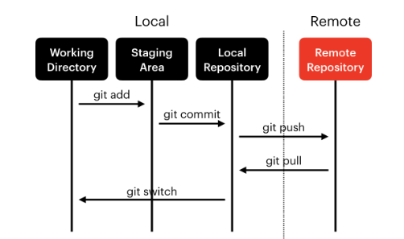

# git

## Prerequisites
- shell: 운영체제의 커널과 사용자를 이어주는 소프트웨어
- vim: 대표적인 에디터

## git, github 이란?
git은 2005년에 리누스 토발즈가 화가나서 일주일 만에 만든 분산 버전 관리 시스템이고, 2008년 git을 이용하는 프로그램들의 원격저장서비스는 github이 개발되었음. git은 시스템이고 github은 서비스임.

## Git Local, Remote Repository
- Working Directory: $ git add
- Staging Area: $ git commit
- Local Repository: git push
- Remote
- 시각적인 자료로 Local과 Remote 개념 이해 중요

 
</img>
 
</img>

## 소감
git과 github이라는 도구가 있다는 것은 알고 있었지 만 오늘 처음으로 연동해서 사용하는 방법을 학습했음. 향후 자주 사용하게 될 것으로 기대하고 있음. 

- git, github은 소프트웨어 개발할 때 매우 중요한 필수 도구
- 개발자들이 협업할 때 없어서는 안되는 도구
- git, github 특히 협업할 때 매우 중요한 도구
